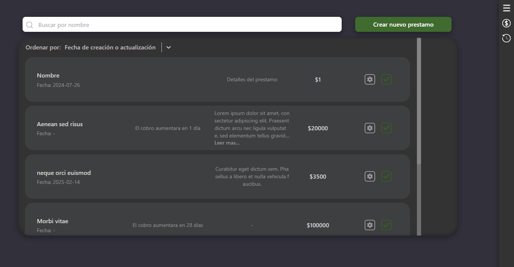

Para usarlo:
1-Abrir la terminal en la carpeta /Prestamos y poner: "pip install -r requirements.txt"
2-Con la terminal abierta en la misma carpeta poner "uvicorn mainPrestamos:app --reload" para iniciar la api
3-Luego "cd electron-vite-project" y "npm run dev"

